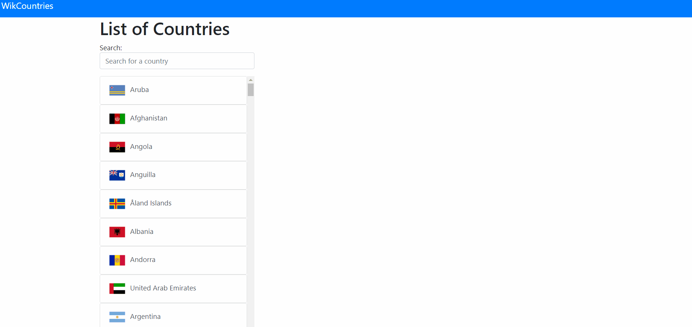

## WikiCountries

Exercise from https://github.com/ironhack-labs/lab-wiki-countries 

React App with focus on ReactRouter library. 
List of countries obtained from a JSON file with diverse information of each country. 

## Video showing App working

## Steps to run the app.

### `npm start`

Runs the app in the development mode. 
Open [http://localhost:3000](http://localhost:3000) to view it in the browser.
